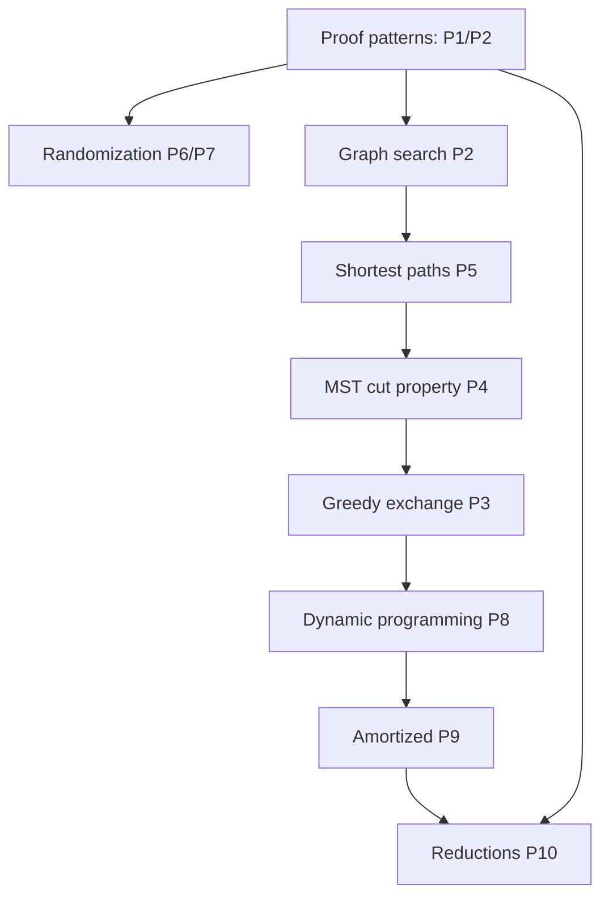

# Maps

This page is the “navigation brain”: lecture sequencing, chapter coverage, and concept dependencies.

## Lecture → Chapter map (Plotkin F10 approximate spine)

| Lecture | Theme | Reader chapter anchors |
|---|---|---|
| 1–2 | Asymptotics, induction & invariants (core proof mechanics) | patterns P1/P2 (see Proof patterns) |
| 3–4 | Randomization toolkit (indicators, linearity, amplification) | ch04: {#thm-4-3}, {#thm-4-4}, {#thm-4-6} |
| 5–7 | Graph search: DFS/BFS, topo order, SCC intuitions | ch05: {#inv-5-1}, {#lem-5-2}, {#thm-5-3} |
| 8–10 | Shortest paths + relaxation worldview | ch06: {#inv-6-1}, {#thm-6-3}, {#thm-6-6} |
| 11–12 | Minimum spanning trees + cut property | ch07: {#def-cut-property}, {#thm-7-1}, {#thm-7-2} |
| 13–14 | Greedy correctness via exchange | ch08: {#thm-8-1}, {#lem-8-2}, {#thm-8-3} |
| 15–17 | Dynamic programming (state/recurrence/order/reconstruct) | ch09: {#tpl-9-1} |
| 18–19 | Amortized analysis + data structures | ch10: {#thm-10-1}, {#thm-10-2} |
| 20+ | NP, reductions, completeness intuition | ch11: {#tpl-11-1} |

**Note:** This is an approximation of the Fall 2010 arc; treat it as a working map until we sync precisely to the lecture notes you’re importing.

## Concept dependency map (Mermaid)

## Hook coverage map

Hooks currently cover a “spine set”:

- thm-4-3 → hook-thm-4-3-quicksort-indicators
- thm-4-6 → hook-thm-4-6-karger-amplify
- thm-6-3 → hook-thm-6-3-dijkstra-finalize
- thm-10-1 → hook-thm-10-1-dynarray-credits

Next targets (high leverage for evidence):
- thm-4-4 QuickSelect expected linear time
- thm-6-6 Bellman–Ford k-edge induction
- thm-7-2 Kruskal cycle-skip correctness (cut property witness)
